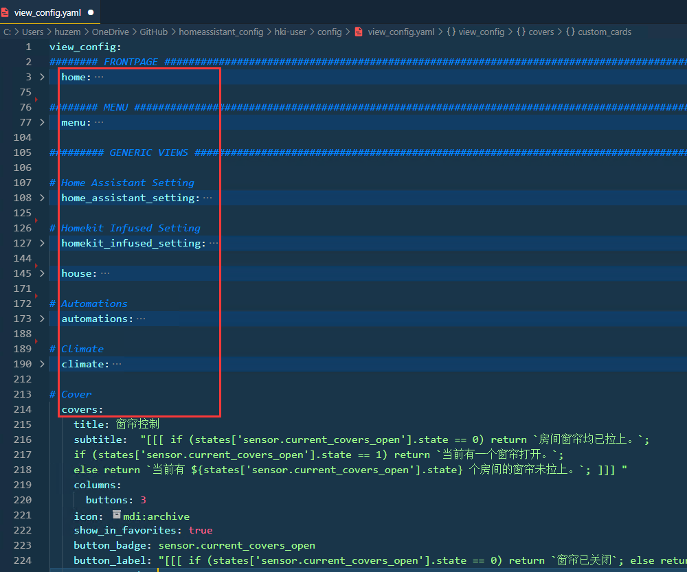

### **关于hki-user/views/下文件及文件夹说明**


此文件夹下均为自定义卡片参考配置，在`view_config.yaml`文件中，定义了如下类似代码的：

```
    custom_cards: 
      position: top
      type: default
```


即开启显示自定义卡片，自定义卡片配置布局配置详情参考[JIMZ011大神的文档说明](https://jimz011.github.io/homekit-infused/custom_views.html) 。


需要注意的一点是**文件夹名**和`view_config.yaml`中`view_config:`下面第二级的标题（view视口名）名字保持一致。





