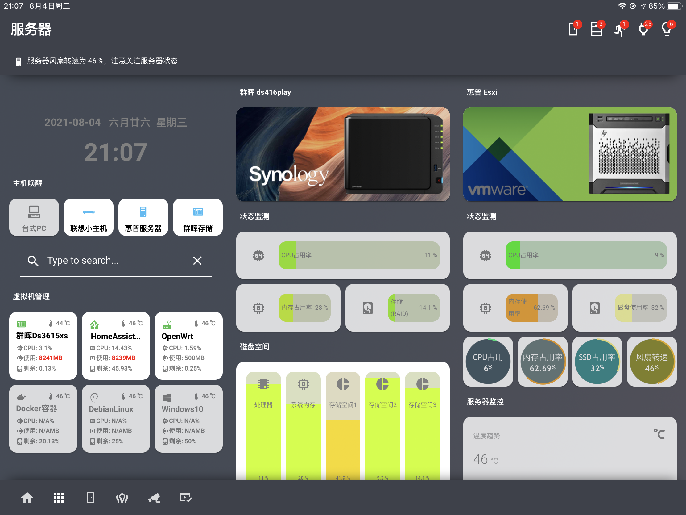
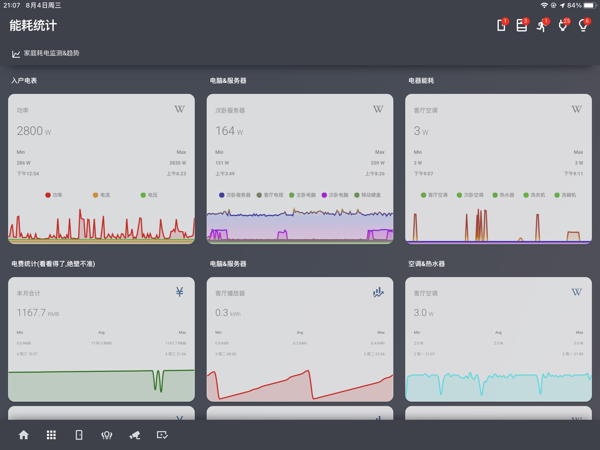
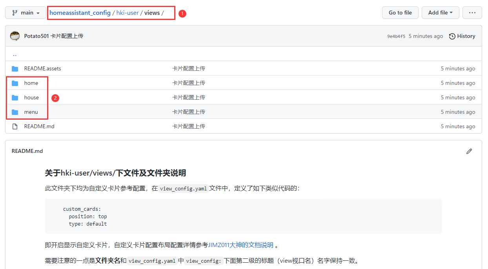

## 说明

**2021-12-10：前段时间打算推倒重来好好整理一下，结果时间没跟上，给论坛和B站发的一些参考教程造成了很大麻烦，还好本地存了一份，重新建一个仓库恢复一下，实在抱歉。**

---

**配置说明文档(Documents&Notes)**：说明文档&笔记&教程；

**设备接入集成(Integrations)**：我自己用到的一些设备接入相关的配置；

**用户界面配置(Lovelace&Frontend)**：Lovelace界面相关的一些配置参考代码；

**我的参考配置(Config)：**我的配置文件示例。

## 重点提示！！！

 - Home Assistant、Lovelace插件还有Homekit Infused以及其他的主题框架本身也都在更新，所有的教程和配置代码均有很强的实效性，仅作参考。

 - 个人能力所限，配置代码也是瞎拼凑的，仅仅是抛砖引玉，希望有愿意分享的真正的大佬给我们分享更多的玩法。

- 本仓库主要分享我自己在玩HomeAssistant界面过程中、个人觉得好玩的界面框架及插件相关，顺便放上自己的示例配置，玩Homekit Infused主题框架比较多，目前我在使用的版本是**2021.11.1**，最新版暂时没有时间尝试和测试。

## 关于Homekit Infused

**Homekit Infused主题来自jimz011大神，相关链接：**

- **Github主页：https://github.com/jimz011/homekit-infused**

- **最新版本：https://github.com/jimz011/homekit-infused/releases**

- **安装&配置：https://jimz011.github.io/homekit-infused/installation.html**

- **插件说明: https://jimz011.github.io/homekit-infused/addons.html**

## 作者配置

作者配置仓库地址：https://github.com/jimz011/homekit-infused/tree/4.x.x-personal

## 示例效果

#### 房间导航

#### 媒体控制

#### 状态监测

#### 能耗统计

**感谢JIMZ011大佬构建了一个这么漂亮的Lovelace框架，同时也感谢Home Assistant开源社区大神们带给我们各种好玩的插件和玩法。**

## 部分配置（待整理和上传）

#### 详细的配置参考和效果:https://github.com/Potato501/homeassistant_config/tree/main/hki-user/views 

---

## BTW

欢迎感兴趣的小伙伴关注我的B站，我会陆陆续续的更新一些相关的视频教程，如果觉得有用，不要忘了给个三连，谢谢 😂。

bilibili地址: https://space.bilibili.com/412408883 

--- update 2021-12-11 by 土豆🥔.

