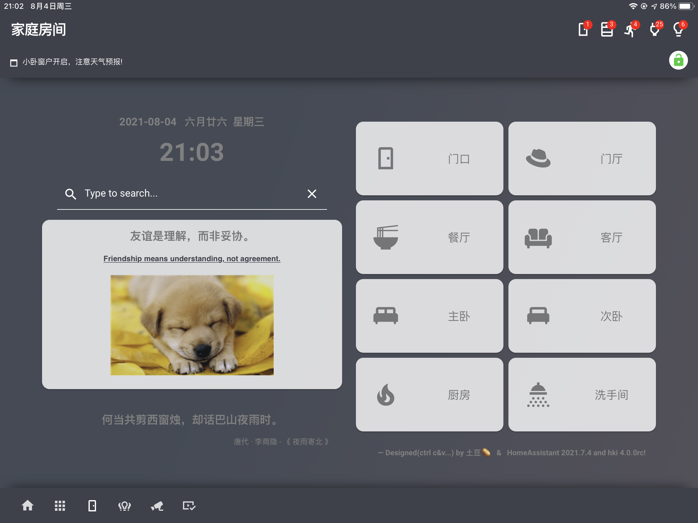

## 1、说明

**2021-12-10：前段时间打算推倒重来好好整理一下，结果时间没跟上，给论坛和B站发的一些参考教程造成了很大麻烦，还好本地存了一份，重新建一个仓库恢复一下，实在抱歉。**

---

**Documents&Notes**：说明文档&笔记&教程；

**Integrations**：我自己用到的一些设备接入相关的配置；

**Lovelace&Frontend**：Lovelace界面相关的一些配置参考代码；

**Config**：我的配置文件示例。

## 2、重点提示！！！

 - Home Assistant、Lovelace插件还有Homekit Infused以及其他的主题框架本身也都在更新，所有的教程和配置代码均有很强的实效性，仅作参考。

 - **个人能力所限，配置代码也是瞎拼凑的，仅仅是抛砖引玉**，希望有愿意分享的真正的大佬给我们分享更多的玩法。

- 玩Homekit Infused主题框架比较多，目前我在使用的版本是**2021.11.1**，**最新版暂时没有时间尝试和测试。**

- Git操作和和Markdown语法也不熟悉，所以仓库将就一下看看，各取所需就好，学这个也是时间成本，所以也提到了不要fork或者star，我也仅仅是觉得这个版本操作便于维护，不然搞个什么都发个帖子会很麻烦...

## 3、Home Assistant &Lovelace界面

### 3.1 Homekit Infused

**Homekit Infused主题来自jimz011大神，相关链接：**

- **Github主页：https://github.com/jimz011/homekit-infused**

- **最新版本：https://github.com/jimz011/homekit-infused/releases**

- **安装&配置：https://jimz011.github.io/homekit-infused/installation.html**

- **插件说明: https://jimz011.github.io/homekit-infused/addons.html**

####  作者配置

作者配置仓库地址：https://github.com/jimz011/homekit-infused/tree/4.x.x-personal

####  示例效果

#####  房间导航：

#####  媒体控制：

##### 状态监测：

####  配置参考（待整理和上传）

 - 自定义卡片配置参考（此部分可能不适用于新版的HKI2021.12.x版本了，暂时留着）:
https://github.com/Potato501/home_assistant/tree/Potato/Config/hki-user/views

 - HKI的界面实体配置文件主要在view_config.yaml文件中，可以参考这个示例（房间的卡片使用了HKI自带的插件配置）：

https://github.com/Potato501/home_assistant/blob/Potato/Config/hki-user/config/view_config.yaml

**感谢JIMZ011大佬构建了一个这么漂亮的Lovelace框架，同时也感谢Home Assistant开源社区大神们带给我们各种好玩的插件和玩法。**

录了2个效果视频，地址：

https://www.bilibili.com/video/BV1uF411z7rg

https://www.bilibili.com/video/BV1YP4y137zz

### 3.2、Mattias Persson大神的界面主题

大神仓库：https://github.com/matt8707/hass-config

官方讨论帖：https://community.home-assistant.io/t/a-different-take-on-designing-a-lovelace-ui/162594

效果视频参考：https://www.bilibili.com/video/BV1CQ4y1z7f9

安装方法（仅参考）：https://www.bilibili.com/video/BV19L4y187f7

配置方式（仅参考）：https://www.bilibili.com/video/BV1CT4y1Z7Zx

示例代码（仅参考）：https://github.com/Potato501/home_assistant/tree/Potato/Config/dashboards/tablet

### 3.3、neon-lovelace-ui-and-theme-for-tablets 主题

仓库地址：https://community.home-assistant.io/t/neon-lovelace-ui-and-theme-for-tablets/307230

这个可以使用HA的WEBUI配置的，不是用yaml文件方式，参考配置代码（目前原作者已经更新了，这是个老版本的示例配置，仅作参考）。

论坛帖子：https://bbs.hassbian.com/thread-13880-1-1.html

示例代码：https://github.com/Potato501/home_assistant/tree/Potato/Config/dashboards/neon

### 3.4、其他说明

以上示例代码需要结合config文件夹下面对应的HA文件夹结构的东西，需要自己参考和调整。

## BTW

欢迎感兴趣的小伙伴关注我的B站，我会陆陆续续的更新一些相关的视频教程，如果觉得有用，不要忘了给个三连，谢谢 😂。

bilibili地址: https://space.bilibili.com/412408883 

--- update 2021-12-11 by 土豆🥔.

