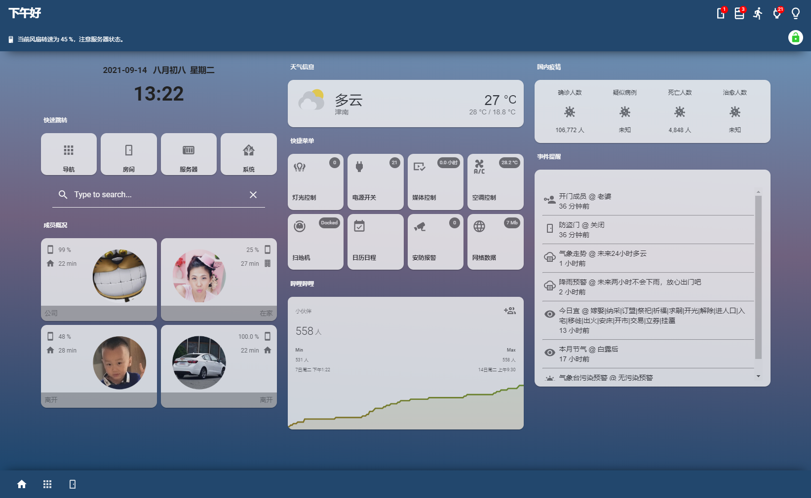

### **卡片效果**

### 集成(integrations)插件

- [**HA自带的coronavirus集成**](https://www.home-assistant.io/integrations/coronavirus)，在设置集成中搜索coronavirus选择区域后添加，目前数据已经不全（也没什么意义了），按需配置。

- **[农历插件](https://bbs.hassbian.com/thread-11407-1-1.html)（来自情非殇大佬）**，注意需要自己按照帖子里面去获取token！！！如果并不需要那个农历，可以无视。
- 其他待补充

### 界面(Lovelace)插件

HKI自带的模板（`hki-base`文件夹下）及分享的修改的模板（`hki-user/templates`文件夹下）

### 配置代码

见文件夹中代码。